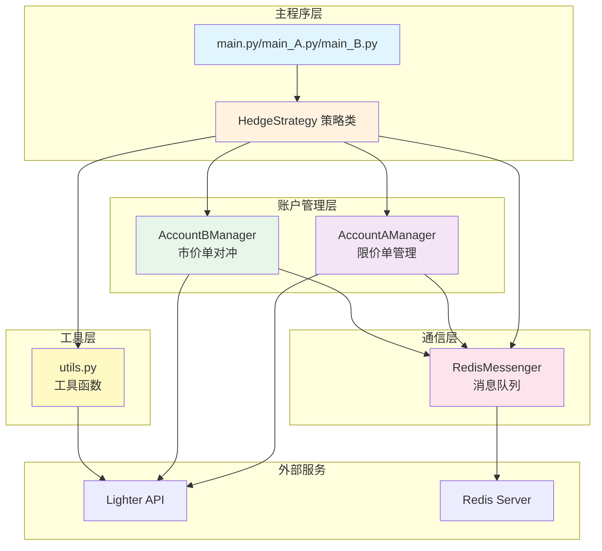
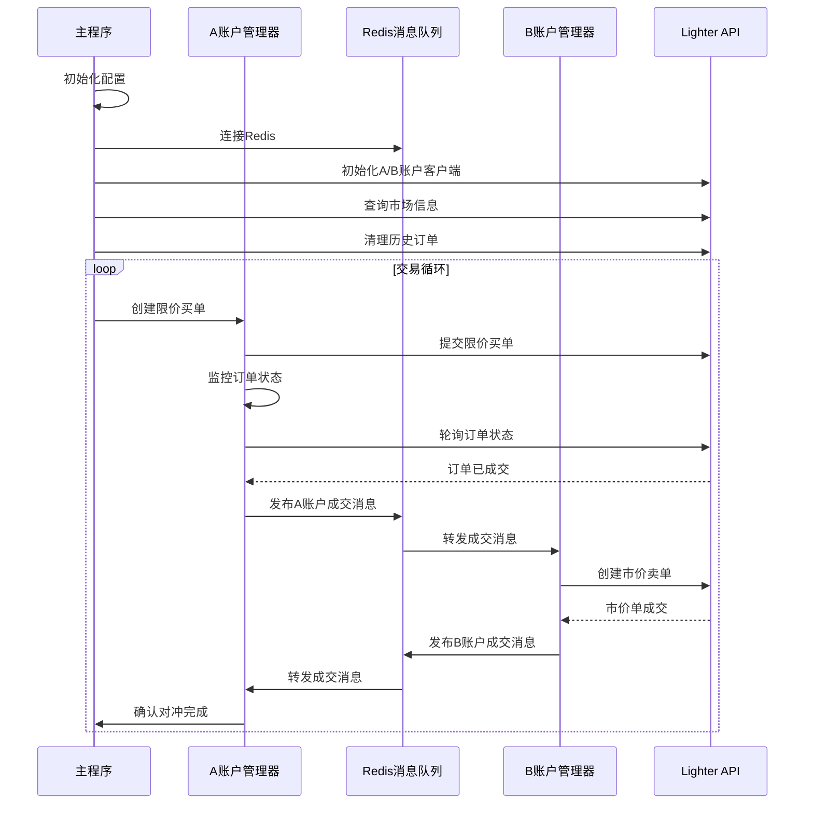
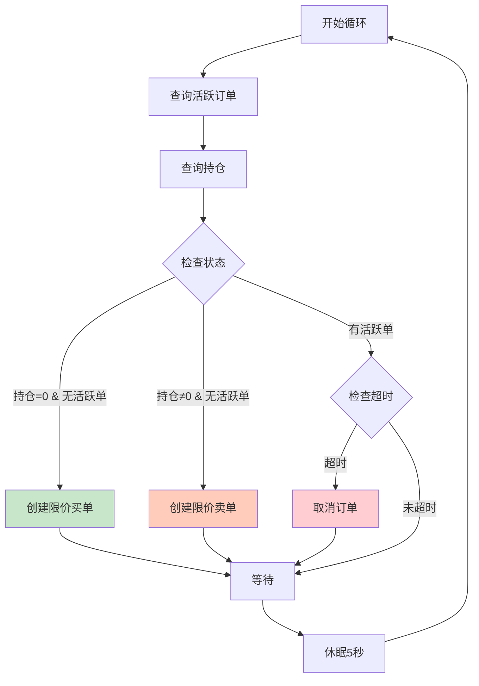
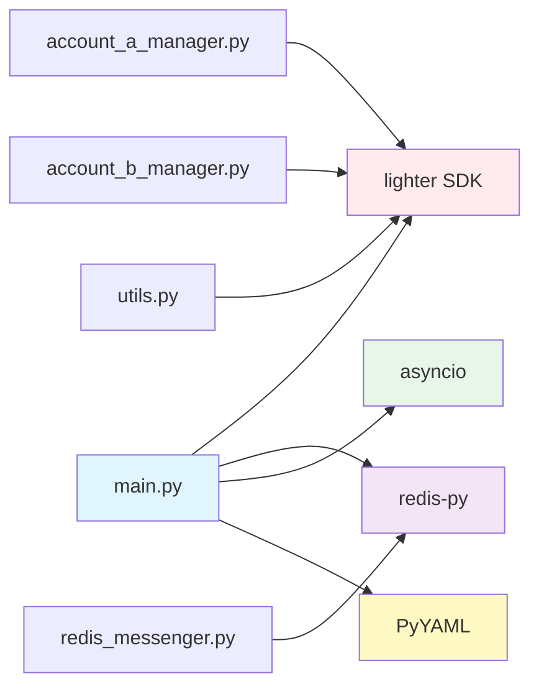

# Lighter-hedge 代码架构分析

## 📋 项目概述

**Lighter-hedge** 是一个基于 Lighter 交易平台的跨账户对冲交易策略系统。该系统通过两个账户（A账户和B账户）实现自动化的对冲交易，利用限价单和市价单的组合来捕获市场机会。

### 核心理念
- **A账户（做多账户）**: 挂限价买单，等待市场成交
- **B账户（做空账户）**: 在A账户成交后立即执行市价卖单对冲
- **Redis消息队列**: 实现两个账户之间的实时通信

---

## 🏗️ 系统架构

### 架构图



---

## 📁 文件结构与职责

### 核心文件

| 文件 | 行数 | 职责 | 关键类/函数 |
|------|------|------|------------|
| [`main.py`](hedge_strategy/main.py) | 314 | 主程序入口（完整版） | `HedgeStrategy`, `main()` |
| [`main_A.py`](hedge_strategy/main_A.py) | 358 | A账户独立运行程序 | `HedgeStrategy`, 持仓管理逻辑 |
| [`main_B.py`](hedge_strategy/main_B.py) | 314 | B账户独立运行程序 | `HedgeStrategy` |
| [`account_a_manager.py`](hedge_strategy/account_a_manager.py) | 423 | A账户管理器 | `AccountAManager` |
| [`account_b_manager.py`](hedge_strategy/account_b_manager.py) | 279 | B账户管理器 | `AccountBManager` |
| [`redis_messenger.py`](hedge_strategy/redis_messenger.py) | 185 | Redis消息管理 | `RedisMessenger` |
| [`utils.py`](hedge_strategy/utils.py) | 328 | 工具函数集合 | 市场查询、订单管理等 |

---

## 🔄 核心工作流程

### 1. 完整版流程 (main.py)



### 2. 独立版流程 (main_A.py)



---

## 🔑 核心组件详解

### 1. HedgeStrategy (策略主类)

**位置**: [`main.py:28-266`](hedge_strategy/main.py:28), [`main_A.py:31-305`](hedge_strategy/main_A.py:31)

**职责**:
- 初始化所有组件（Redis、API客户端、账户管理器）
- 协调A/B账户的交易流程
- 管理策略生命周期（启动、运行、停止、清理）

**关键方法**:
```python
async def initialize()      # 初始化所有组件
async def run()             # 运行策略主循环
async def cleanup()         # 清理资源
def stop()                  # 停止策略
```

**main_A.py 的特殊逻辑**:
- 实现了基于持仓和活跃单状态的智能决策
- 支持订单超时自动取消机制
- 独立运行，不依赖B账户

---

### 2. AccountAManager (A账户管理器)

**位置**: [`account_a_manager.py:22-423`](hedge_strategy/account_a_manager.py:22)

**职责**:
- 创建和管理限价买单/卖单
- 监控订单状态直到完全成交
- 通过Redis发送成交通知

**关键方法**:

| 方法 | 行数 | 功能 |
|------|------|------|
| [`create_limit_buy_order()`](hedge_strategy/account_a_manager.py:61) | 61-149 | 创建限价买单，支持nonce错误重试 |
| [`create_limit_sell_order()`](hedge_strategy/account_a_manager.py:151) | 151-239 | 创建限价卖单 |
| [`monitor_order_until_filled()`](hedge_strategy/account_a_manager.py:267) | 267-354 | 轮询监控订单状态 |
| [`_notify_order_filled()`](hedge_strategy/account_a_manager.py:356) | 356-387 | 发送成交通知到Redis |
| [`wait_for_b_filled()`](hedge_strategy/account_a_manager.py:399) | 399-418 | 等待B账户对冲完成 |

**特点**:
- ✅ 支持nonce错误自动重试（最多3次）
- ✅ 轮询间隔可配置
- ✅ 完善的错误处理机制

---

### 3. AccountBManager (B账户管理器)

**位置**: [`account_b_manager.py:21-279`](hedge_strategy/account_b_manager.py:21)

**职责**:
- 监听A账户成交消息
- 执行市价卖单对冲
- 发送对冲完成通知

**关键方法**:

| 方法 | 行数 | 功能 |
|------|------|------|
| [`on_a_account_filled()`](hedge_strategy/account_b_manager.py:48) | 48-58 | Redis消息回调 |
| [`_execute_hedge()`](hedge_strategy/account_b_manager.py:60) | 60-103 | 执行对冲逻辑 |
| [`_create_market_sell_order()`](hedge_strategy/account_b_manager.py:105) | 105-184 | 创建市价卖单 |
| [`_get_order_info()`](hedge_strategy/account_b_manager.py:186) | 186-234 | 查询订单信息 |
| [`_notify_hedge_completed()`](hedge_strategy/account_b_manager.py:236) | 236-268 | 发送对冲完成通知 |

**特点**:
- ✅ 异步处理对冲请求
- ✅ 支持重试机制（可配置次数）
- ✅ 市价单立即成交验证

---

### 4. RedisMessenger (消息管理器)

**位置**: [`redis_messenger.py:13-185`](hedge_strategy/redis_messenger.py:13)

**职责**:
- 管理Redis连接
- 实现Pub/Sub消息模式
- 提供消息发布和订阅接口

**消息通道**:
```python
CHANNEL_A_FILLED = "hedge:account_a_filled"  # A账户成交通知
CHANNEL_B_FILLED = "hedge:account_b_filled"  # B账户成交通知
```

**关键方法**:

| 方法 | 行数 | 功能 |
|------|------|------|
| [`connect()`](hedge_strategy/redis_messenger.py:38) | 38-52 | 连接Redis服务器 |
| [`publish_a_filled()`](hedge_strategy/redis_messenger.py:54) | 54-61 | 发布A账户成交消息 |
| [`publish_b_filled()`](hedge_strategy/redis_messenger.py:63) | 63-70 | 发布B账户成交消息 |
| [`subscribe()`](hedge_strategy/redis_messenger.py:88) | 88-100 | 订阅消息通道 |
| [`start_listening()`](hedge_strategy/redis_messenger.py:123) | 123-131 | 启动监听线程 |
| [`create_filled_message()`](hedge_strategy/redis_messenger.py:149) | 149-184 | 创建标准消息格式 |

**消息格式**:
```python
{
    "account_index": int,
    "market_index": int,
    "order_index": int,
    "filled_base_amount": str,
    "filled_quote_amount": str,
    "avg_price": str,
    "timestamp": int,
    "side": "buy" | "sell"
}
```

---

### 5. Utils (工具函数模块)

**位置**: [`utils.py:1-328`](hedge_strategy/utils.py:1)

**核心函数**:

| 函数 | 行数 | 功能 |
|------|------|------|
| [`get_market_index_by_name()`](hedge_strategy/utils.py:21) | 21-64 | 根据市场名称查询市场索引 |
| [`get_orderbook_price_at_depth()`](hedge_strategy/utils.py:67) | 67-119 | 获取订单簿指定档位价格 |
| [`cancel_all_orders()`](hedge_strategy/utils.py:122) | 122-182 | 取消所有活跃订单 |
| [`get_account_active_orders()`](hedge_strategy/utils.py:185) | 185-234 | 查询活跃订单 |
| [`get_positions()`](hedge_strategy/utils.py:237) | 237-270 | 获取持仓信息 |
| [`calculate_avg_price()`](hedge_strategy/utils.py:286) | 286-306 | 计算平均成交价格 |
| [`load_config()`](hedge_strategy/utils.py:309) | 309-328 | 加载YAML配置文件 |

**特点**:
- ✅ API限流处理（429错误自动重试）
- ✅ 指数退避策略
- ✅ 完善的错误处理

---

## 🔧 技术特性

### 1. 错误处理机制

#### Nonce错误处理
```python
# account_a_manager.py:114-121
if "invalid nonce" in str(err).lower():
    logging.warning(f"Nonce错误，刷新nonce管理器后重试")
    self.signer_client.nonce_manager.hard_refresh_nonce(
        self.signer_client.api_key_index
    )
    retry_count += 1
    await asyncio.sleep(1)
    continue
```

#### API限流处理
```python
# utils.py:53-58
if "429" in str(e) or "Too Many Requests" in str(e):
    retry_count += 1
    wait_time = min(2 ** retry_count, 30)  # 指数退避
    logging.warning(f"API限流，等待{wait_time}秒后重试")
    await asyncio.sleep(wait_time)
    continue
```

### 2. 异步编程模式

- 使用 `asyncio` 实现异步操作
- 所有API调用都是异步的
- Redis消息处理在独立线程中运行

### 3. 配置管理

配置文件结构（YAML格式）:
```yaml
lighter:
  base_url: "API地址"
  maker_order_time_out: 60  # 订单超时时间

redis:
  host: "localhost"
  port: 6379
  db: 0

accounts:
  account_a:
    api_key_private_key: "私钥"
    account_index: 0
    api_key_index: 0
  account_b:
    api_key_private_key: "私钥"
    account_index: 1
    api_key_index: 0

strategy:
  poll_interval: 1      # 轮询间隔
  retry_times: 3        # 重试次数
```

---

## 📊 三个版本对比

| 特性 | main.py | main_A.py | main_B.py |
|------|---------|-----------|-----------|
| **运行模式** | 完整对冲系统 | A账户独立运行 | B账户独立运行 |
| **账户数量** | A + B | 仅A | A + B |
| **决策逻辑** | 简单循环 | 智能状态机 | 简单循环 |
| **持仓管理** | ❌ | ✅ | ❌ |
| **超时处理** | ❌ | ✅ | ❌ |
| **Redis依赖** | ✅ | ❌ | ✅ |
| **适用场景** | 完整对冲 | 单边做市 | 被动对冲 |

### main_A.py 的核心逻辑

```python
# main_A.py:193-235
if get_position == 0 and not active_orders:
    # 无持仓 + 无活跃单 → 限价开多
    await create_limit_buy_order()
    
elif get_position != 0 and not active_orders:
    # 有持仓 + 无活跃单 → 限价平多
    await create_limit_sell_order()
    
else:
    # 有活跃单 → 检查超时
    if order_timeout > maker_order_time_out:
        await cancel_order()
```

---

## 🎯 设计模式与最佳实践

### 1. 单一职责原则
- 每个类只负责一个特定功能
- `AccountAManager` 只管理A账户
- `RedisMessenger` 只处理消息通信

### 2. 依赖注入
```python
# main.py:136-144
self.account_a_manager = AccountAManager(
    signer_client=self.client_a,
    redis_messenger=self.redis_messenger,
    account_index=account_a_config['account_index'],
    market_index=self.market_index,
    base_amount=self.quantity,
    depth=self.depth,
    poll_interval=self.config['strategy']['poll_interval']
)
```

### 3. 观察者模式
- Redis Pub/Sub 实现事件驱动
- A账户成交触发B账户对冲

### 4. 重试模式
- 所有关键操作都有重试机制
- 指数退避策略避免过度请求

---

## ⚠️ 潜在问题与改进建议

### 1. 代码重复
**问题**: `main.py`, `main_A.py`, `main_B.py` 有大量重复代码

**建议**:
```python
# 提取公共基类
class BaseHedgeStrategy:
    async def initialize(self):
        # 公共初始化逻辑
        pass
    
    async def cleanup(self):
        # 公共清理逻辑
        pass

class FullHedgeStrategy(BaseHedgeStrategy):
    async def run(self):
        # 完整对冲逻辑
        pass

class AccountAStrategy(BaseHedgeStrategy):
    async def run(self):
        # A账户独立逻辑
        pass
```

### 2. 硬编码路径
**问题**: 配置文件路径硬编码
```python
# main.py:276
default='/Users/liujian/Documents/workspances/Lighter-hedge/hedge_strategy/config.yaml'
```

**建议**:
```python
import os
default_config = os.path.join(
    os.path.dirname(__file__), 
    'config.yaml'
)
```

### 3. 日志管理
**问题**: 日志配置在每个主程序中重复

**建议**:
```python
# logger.py
def setup_logger(name, level=logging.INFO):
    logger = logging.getLogger(name)
    handler = logging.StreamHandler()
    formatter = logging.Formatter(
        '%(asctime)s [%(levelname)s] %(message)s'
    )
    handler.setFormatter(formatter)
    logger.addHandler(handler)
    logger.setLevel(level)
    return logger
```

### 4. 错误恢复
**问题**: 对冲失败后缺少自动恢复机制

**建议**:
- 实现持仓不平衡检测
- 添加自动平仓功能
- 记录失败订单到数据库

### 5. 监控告警
**问题**: 缺少系统监控和告警机制

**建议**:
- 集成Prometheus监控
- 添加关键指标（成交率、延迟、错误率）
- 实现钉钉/邮件告警

### 6. 测试覆盖
**问题**: 没有单元测试和集成测试

**建议**:
```python
# tests/test_account_a_manager.py
import pytest
from unittest.mock import Mock, AsyncMock

@pytest.mark.asyncio
async def test_create_limit_buy_order():
    manager = AccountAManager(...)
    success = await manager.create_limit_buy_order(1000, 100)
    assert success == True
```

### 7. 配置验证
**问题**: 缺少配置文件验证

**建议**:
```python
from pydantic import BaseModel, validator

class AccountConfig(BaseModel):
    api_key_private_key: str
    account_index: int
    api_key_index: int
    
    @validator('account_index')
    def validate_account_index(cls, v):
        if v < 0:
            raise ValueError('account_index must be >= 0')
        return v
```

---

## 📈 性能优化建议

### 1. 连接池
```python
# 使用连接池减少连接开销
from redis import ConnectionPool

pool = ConnectionPool(
    host='localhost',
    port=6379,
    max_connections=10
)
redis_client = redis.Redis(connection_pool=pool)
```

### 2. 批量操作
```python
# 批量取消订单
async def cancel_orders_batch(order_indices):
    tasks = [
        cancel_order(idx) 
        for idx in order_indices
    ]
    await asyncio.gather(*tasks)
```

### 3. 缓存机制
```python
# 缓存市场信息
from functools import lru_cache

@lru_cache(maxsize=128)
async def get_market_info(market_name):
    # 减少重复API调用
    pass
```

---

## 🔐 安全建议

### 1. 密钥管理
```python
# 使用环境变量
import os
from dotenv import load_dotenv

load_dotenv()
private_key = os.getenv('ACCOUNT_A_PRIVATE_KEY')
```

### 2. 参数验证
```python
def validate_quantity(quantity):
    if quantity <= 0:
        raise ValueError("Quantity must be positive")
    if quantity > MAX_QUANTITY:
        raise ValueError("Quantity exceeds maximum")
```

### 3. 限流保护
```python
from ratelimit import limits, sleep_and_retry

@sleep_and_retry
@limits(calls=10, period=1)
async def create_order():
    # 限制每秒最多10次调用
    pass
```

---

## 📚 依赖关系



---

## 🚀 部署建议

### 1. Docker化
```dockerfile
FROM python:3.9-slim

WORKDIR /app
COPY requirements.txt .
RUN pip install -r requirements.txt

COPY hedge_strategy/ ./hedge_strategy/
CMD ["python", "-m", "hedge_strategy.main_A", 
     "--market", "ETH", 
     "--quantity", "1", 
     "--depth", "1"]
```

### 2. 进程管理
```ini
# supervisor.conf
[program:hedge_a]
command=python -m hedge_strategy.main_A --market ETH --quantity 1 --depth 1
autostart=true
autorestart=true
```

### 3. 健康检查
```python
# health_check.py
async def check_health():
    checks = {
        'redis': await check_redis_connection(),
        'api': await check_api_connection(),
        'orders': await check_active_orders()
    }
    return all(checks.values())
```

---

## 📝 总结

### 优点
✅ 架构清晰，职责分明  
✅ 异步编程，性能良好  
✅ 错误处理完善  
✅ 支持多种运行模式  
✅ 配置灵活

### 待改进
⚠️ 代码重复较多  
⚠️ 缺少测试覆盖  
⚠️ 监控告警不足  
⚠️ 文档需要完善  
⚠️ 安全性可以加强

### 适用场景
- 加密货币做市策略
- 跨账户对冲交易
- 高频交易系统
- 自动化交易机器人

---

**分析完成时间**: 2025-10-23  
**分析版本**: v1.0.0  
**代码版本**: 基于当前仓库代码